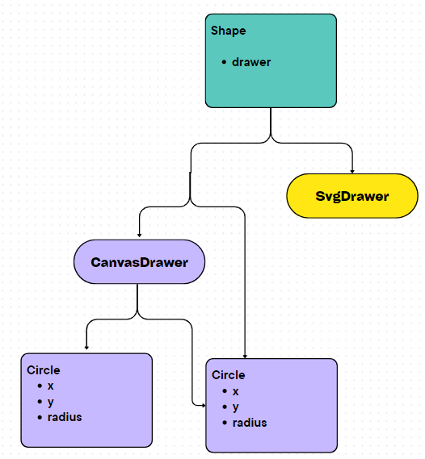

# ATIVIDADE PADRAO DE PROJETO
Repositório para a atividade de Engenharia de Software

# Factory Method (Criacional)

Este padrão fornece uma interface para criar objetos em uma superclasse, mas permite que as subclasses alterem o tipo de objetos que serão criados. Ele resolve o problema de criar objetos sem especificar a classe exata do objeto que será criado, permitindo que as subclasses decidam qual objeto criar com base na lógica específica de cada subclasse.

#### [Exemplo:](https://github.com/RafaelaTieri/Atividade-padr-o-de-projeto/blob/main/factory_method.js)

Aqui `VehicleFactory` é uma classe abstrata que define o método `factoryMethod`, que será implementado pelas subclasses `CarFactory` e `BicycleFactory`.
Cada fábrica é responsável por um tipo de veículo, `Car` e `Bicycle` que são classes de produtos.
O método `createVehicle` da `VehicleFactory` é o método público que cria os veículos usando o `factoryMethod`.

Assim podemos ver que conseguimos criar objetos sem a necessidade de especificar uma classe exata, delegando isto para subclasses específicas.
Isso torna o código mais flexível e extensível, pois novos tipos de veículos podem ser adicionados facilmente sem alterar o código existente.

# Bridge (Estrutural)

Este padrão é usado para separar uma abstração (interface) de sua implementação, permitindo que ambas possam variar independentemente umas das outras. Isso é útil quando há múltiplas dimensões de variação em um sistema.

Por exemplo, suponha que você tenha diferentes formas geométricas (abstração) e diferentes meios de desenhá-las (implementação). Você pode querer desenhar as formas em diferentes ambientes, como em um canvas HTML5, em uma janela de GUI, em um arquivo SVG etc. O Bridge permite que você altere tanto as formas quanto os meios de desenhá-las sem precisar modificar o código existente.

#### [Exemplo:](https://github.com/RafaelaTieri/Atividade-padr-o-de-projeto/blob/main/bridge.js)

Neste exemplo, `Shape` é a abstração, `CanvasDrawer` e `SvgDrawer` são implementações, e `Circle` é uma subclasse de `Shape`. 
Isso demostra como você pode criar diferentes formas e desenhá-las em diferentes meios (canvas HTML5 ou SVG) sem modificar as formas ou os meios de desenho, mantendo o código flexível e fácil de estender.

# Chain of Responsibility (Comportamental)

Este padrão é útil quando você tem uma cadeia de objetos que podem processar um pedido, mas não sabe qual deles realmente o fará até o momento da execução. Ele permite que vários objetos possam ter a oportunidade de processar uma solicitação sem que o remetente precise conhecer qual objeto específico está lidando com ela.

#### [Exemplo:](https://github.com/RafaelaTieri/Atividade-padr-o-de-projeto/blob/main/chain_of_responsability.js)

Neste exemplo, temos três níveis de aprovação: `Gerente`, `Diretor` e `CEO`. 
Cada aprovador tem um limite de aprovação. Se uma despesa exceder o limite do aprovador atual, ela é passada para o próximo na cadeia. 
Se a despesa não puder ser aprovada por nenhum aprovador na cadeia, uma mensagem adequada é exibida.

Este padrão é útil quando você precisa desacoplar remetentes de receptores, fornecendo mais flexibilidade na maneira como as solicitações são tratadas. 
Ele permite adicionar ou modificar facilmente os comportamentos de tratamento de solicitações sem afetar o remetente.

